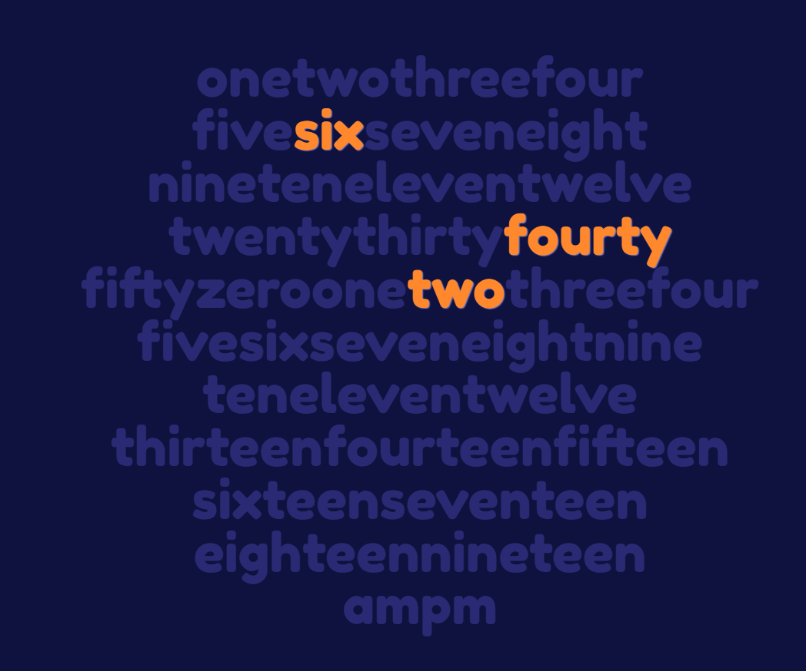

# Word Clock JavaScript Application

## Author
Kavan Bhavsar

## Description
This project displays the time in words using JavaScript.

## Keywords
- Word Clock
- JavaScript
- HTML
- CSS

## Usage
This Word Clock JavaScript Application displays the time using a creative and engaging format. The time is represented in words, making it a fun and unique way to check the time.

Visit <a href="https://kavanbhavsar35.github.io/World-Clock/" target="_blank">here</a> to see the website without installing.

## Installation
1. Clone the repository to your local machine.
2. Open the `index.html` file in your web browser.

## Screenshots

## License
This project is licensed under the MIT License - see the [LICENSE](LICENSE.txt) file for details.
